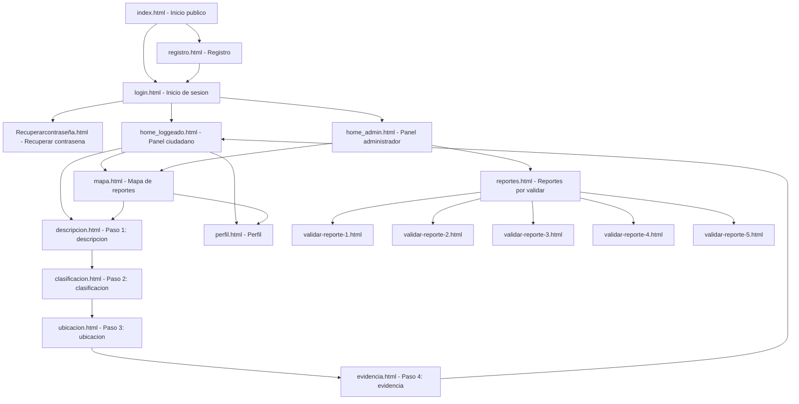

# Alcance funcional implementado en el codigo

Este documento resume las funcionalidades que si estan representadas en el codigo actual del proyecto Observatorio del Agua. El alcance corresponde a un MVP web con frontend en archivos HTML y backend NestJS con MongoDB.

## Actualizacion de implementacion

Se agregaron las funcionalidades pendientes del MVP:

- Comentarios en reportes con API y vista de detalle.
- Moderacion de comentarios mediante eliminacion desde la vista de detalle para administradores.
- Edicion y eliminacion de reportes desde `perfil.html`.
- Eliminacion y validacion de reportes desde `reportes.html`.
- Gestion visual de usuarios desde `admin-users.html`.
- Mapa real con Leaflet y OpenStreetMap en `mapa.html`.
- Almacenamiento real de fotografias en `backend/uploads` mediante `POST /api/uploads/photos`.
- Filtros por tipo, ubicacion y estado en mapa/reportes.
- Dashboard administrativo con estadisticas reales desde `GET /api/reports/stats/summary`.
- Configuracion de alertas desde `admin-alertas.html` y API `/api/alerts`.

## 1. Descripcion de la aplicacion

La aplicacion es una plataforma digital orientada al reporte ciudadano de problematicas relacionadas con la calidad del agua. Permite que los usuarios se registren, inicien sesion, creen reportes de contaminacion mediante un flujo por pasos, asignen una ubicacion, clasifiquen el tipo de contaminacion y agreguen evidencia fotografica simulada.

Tambien incluye vistas para consultar reportes en un mapa simulado, revisar reportes desde un panel administrativo y validar reportes pendientes. La herramienta funciona como una base de ciencia ciudadana porque organiza informacion ambiental aportada por la comunidad.

## 2. Problemas que resuelve

- Falta de informacion accesible sobre problemas visibles en cuerpos hidricos.
- Baja participacion ciudadana en el registro de situaciones ambientales.
- Necesidad de visibilizar reportes locales de contaminacion del agua.
- Necesidad de organizar reportes ciudadanos para revision administrativa.

## 3. Usuarios a los que va dirigido

- Ciudadanos y comunidades locales.
- Organizaciones ambientales.
- Estudiantes, docentes e investigadores.
- Administradores o validadores encargados de revisar reportes.

## 4. Objetivos de la aplicacion

- Desarrollar una aplicacion web para el monitoreo ciudadano de problemas asociados al estado del agua.
- Implementar registro e inicio de sesion para permitir la participacion de usuarios en la plataforma.
- Permitir la creacion de reportes de contaminacion mediante un formulario por pasos.
- Registrar informacion descriptiva, clasificacion, ubicacion y evidencia visual asociada al reporte.
- Visualizar reportes mediante un mapa interactivo simulado con marcadores.
- Incorporar una vista administrativa para listar y revisar reportes pendientes de validacion.
- Aplicar criterios de accesibilidad WCAG 2.2 AA en las pantallas HTML del proyecto.

## 5. Funcionalidades implementadas

### Gestion de usuarios

| Funcion | Estado | Evidencia en codigo |
|---|---|---|
| Registro de usuarios | Implementado | `registro.html`, `backend/src/users/users.controller.ts`, `backend/src/users/users.service.ts` |
| Inicio de sesion | Implementado | `login.html`, `backend/src/auth/auth.controller.ts`, `backend/src/auth/auth.service.ts` |
| Autenticacion con JWT | Implementado | `backend/src/auth/auth.service.ts`, `backend/src/auth/jwt.strategy.ts` |
| Login con Google | Parcial | `login.html`, `backend/src/auth/google.strategy.ts`, `backend/src/auth/auth.controller.ts` |
| Cierre de sesion | Parcial | Enlaces a `index.html`; no hay limpieza centralizada de `localStorage` |
| Recuperar contrasena | Simulado | `Recuperarcontraseña.html` |
| Verificacion de correo | Vista estatica | `verificarcorreo.html` |

### Gestion de reportes

| Funcion | Estado | Evidencia en codigo |
|---|---|---|
| Crear reporte | Implementado | `descripcion.html`, `clasificacion.html`, `ubicacion.html`, `evidencia.html`, `backend/src/reports/reports.controller.ts` |
| Guardar descripcion | Implementado en frontend | `descripcion.html` usa `localStorage` |
| Clasificar contaminacion | Implementado en frontend | `clasificacion.html` usa checkboxes/radios y `localStorage` |
| Registrar ubicacion | Implementado de forma simulada | `ubicacion.html` guarda coordenadas simuladas |
| Enviar reporte al backend | Implementado | `evidencia.html` envia `POST /api/reports` |
| Editar reportes propios | No implementado | No existe pantalla ni flujo conectado |
| Eliminar reportes propios | No implementado | El backend tiene `DELETE /reports/:id`, pero no hay interfaz de usuario conectada |

### Evidencia visual

| Funcion | Estado | Evidencia en codigo |
|---|---|---|
| Carga de fotografias | Simulada | `evidencia.html` permite seleccionar archivo y actualiza progreso visual |
| Visualizacion de fotografias | Simulada | Tarjetas visuales en `evidencia.html`, `perfil.html` y `validar-reporte-*.html` |
| Almacenamiento real de archivos | No implementado | No hay endpoint de upload ni almacenamiento de archivos |

### Visualizacion y seguimiento

| Funcion | Estado | Evidencia en codigo |
|---|---|---|
| Mapa de reportes | Simulado | `mapa.html`, `index.html`, `home_admin.html` |
| Marcadores en mapa | Implementado de forma estatica | `mapa.html` contiene enlaces a reportes |
| Consulta de detalle de reporte | Parcial | `validar-reporte-*.html` muestran detalles estaticos |
| Filtrado de reportes | Implementado en bandeja admin | `reportes.html` filtra por urgencia |
| Filtrado por ubicacion/tipo | No implementado | No hay formulario o consulta conectada para esos filtros |

### Interaccion ciudadana

| Funcion | Estado | Evidencia en codigo |
|---|---|---|
| Publicacion de comentarios | No implementado | No hay modulo, esquema, endpoint ni pantalla conectada |
| Visualizacion de comentarios | No implementado | No hay datos ni interfaz para comentarios |

### Administracion del sistema

| Funcion | Estado | Evidencia en codigo |
|---|---|---|
| Panel administrativo inicial | Implementado | `home_admin.html` |
| Bandeja de reportes pendientes | Implementado de forma estatica | `reportes.html` |
| Validacion de reportes | Simulada | `validar-reporte-1.html` a `validar-reporte-5.html` |
| Gestion de usuarios admin | Parcial backend | `backend/src/users/users.controller.ts` expone CRUD, pero no existe pantalla admin conectada |
| Moderacion/eliminacion de reportes | Parcial backend | `backend/src/reports/reports.controller.ts` expone `DELETE`, pero no existe UI conectada |
| Moderacion de comentarios | No implementado | No existe modulo de comentarios |

## 6. Diseno de caracteristicas implementadas

| Modulo | Caracteristica | Descripcion del diseno | Componentes involucrados |
|---|---|---|---|
| Gestion de usuarios | Registro de usuarios | Permite crear una cuenta mediante formulario y guardar el usuario en MongoDB. | `registro.html`, UsersController, UsersService, UserSchema |
| Gestion de usuarios | Inicio de sesion | Permite autenticar con correo y contrasena. Si las credenciales son validas, retorna un JWT. | `login.html`, AuthController, AuthService, JwtStrategy |
| Gestion de usuarios | Recuperacion de contrasena | Presenta una interfaz para solicitar recuperacion de cuenta, simulando la experiencia del usuario. | `Recuperarcontraseña.html` |
| Gestion de reportes | Descripcion del reporte | Permite ingresar titulo, descripcion y cuerpo hidrico afectado. | `descripcion.html`, `localStorage` |
| Gestion de reportes | Clasificacion | Permite seleccionar tipos de contaminacion y nivel de urgencia. | `clasificacion.html`, `localStorage` |
| Gestion de reportes | Ubicacion georreferenciada | Permite guardar direccion y coordenadas simuladas del reporte. | `ubicacion.html`, `localStorage` |
| Evidencia visual | Carga de evidencia | Permite seleccionar una imagen y simula avance de carga. | `evidencia.html` |
| Gestion de reportes | Envio al backend | Compila los datos del flujo y crea un reporte mediante API. | `evidencia.html`, ReportsController, ReportsService, ReportSchema |
| Visualizacion | Mapa de reportes | Muestra un mapa visual con marcadores enlazados a reportes. | `mapa.html` |
| Administracion | Bandeja de reportes | Lista reportes pendientes y permite filtrarlos por urgencia. | `reportes.html` |
| Administracion | Panel de validacion | Muestra detalle del reporte y opciones de decision de validacion. | `validar-reporte-*.html` |
| Perfil | Perfil de usuario | Muestra datos y reportes recientes de ejemplo del usuario. | `perfil.html` |

## 7. Mapa de navegacion implementado

## 8. Tipo de navegacion implementada

- Navegacion publica: desde `index.html` hacia registro o login.
- Navegacion autenticada de ciudadano: desde `home_loggeado.html` hacia mapa, reporte y perfil.
- Navegacion por pasos: el reporte se crea en secuencia `descripcion.html` -> `clasificacion.html` -> `ubicacion.html` -> `evidencia.html`.
- Navegacion administrativa: desde `home_admin.html` hacia bandeja de reportes y validacion.
- Navegacion por enlaces: el proyecto usa archivos HTML independientes conectados por enlaces, sin router frontend.

## 9. Funcionalidades no implementadas todavia

Estas funcionalidades estaban en el alcance conceptual, pero no aparecen completas en el codigo actual:

- Comentarios en reportes.
- Moderacion de comentarios.
- Edicion de reportes desde interfaz.
- Eliminacion de reportes desde interfaz.
- Gestion visual de usuarios desde panel administrador.
- Mapa real con API externa.
- Almacenamiento real de fotografias.
- Filtros avanzados por ubicacion o tipo de contaminacion.
- Dashboard administrativo con estadisticas reales.
- Configuracion de alertas.
